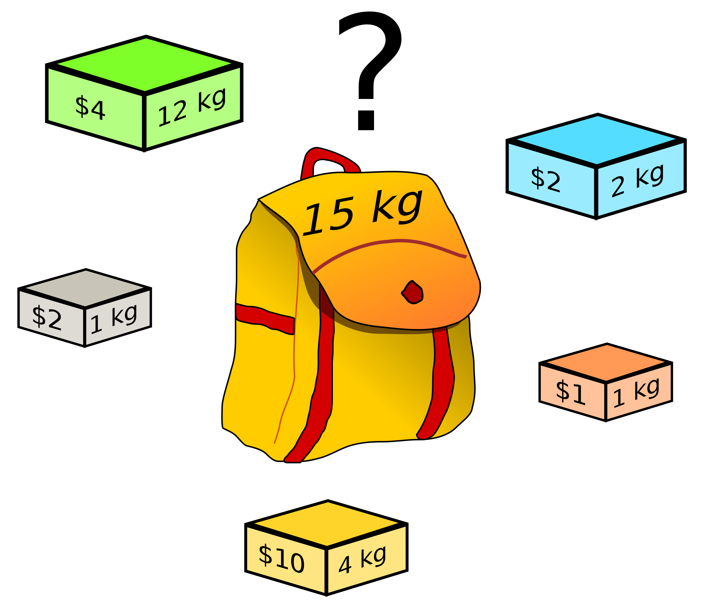
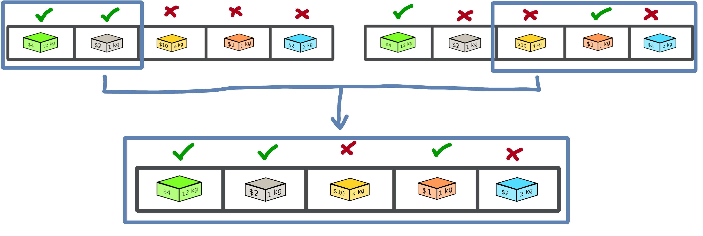

===================
A tour of Macop
===================

.. image:: _static/logo_macop.png
   :width: 300 px
   :align: center

This documentation will allow a user who wishes to use the **Macop** optimisation package to understand both how it works and offers examples of how to implement specific needs.

It will gradually take up the major ideas developed within **Macop** to allow for quick development. You can navigate directly via the menu available below to access a specific part of the documentation.

Introduction
================

`Macop` is a python package for solving discrete optimisation problems in nature. Continuous optimisation is also applicable but not yet developed. The objective is to allow a user to exploit the basic structure proposed by this package to solve a problem specific to him. The interest is that he can quickly abstract himself from the complications related to the way of evaluating, comparing, saving the progress of the search for good solutions but rather concentrate if necessary on his own algorithm. Indeed, `Macop` offers the following main and basic features: 

- **solutions:** representation of the solution;
- **validator:** such as constraint programmig, a `validator` is function which is used for validate or not a solution data state;
- **evaluator:** stores problem instance data and implement a `compute` method in order to evaluate a solution;
- **operators:** mutators, crossovers update of solution;
- **policies:** the way you choose the available operators (might be using reinforcement learning);
- **algorithms:** generic and implemented optimisation research algorithms;
- **callbacks:** callbacks to automatically keep track of the search space advancement.

.. image:: _static/documentation/macop_behaviour.png
   :width: 50 %
   :align: center

Based on all of these generic and/or implemented functionalities, the user will be able to quickly develop a solution to his problem while retaining the possibility of remaining in control of his development by overloading existing functionalities if necessary.

Problem instance
===================

In this tutorial, we introduce the way of using **Macop** and running your algorithm quickly using the well known `knapsack` problem.

Problem definition
~~~~~~~~~~~~~~~~~~~~~~

The **knapsack problem** is a problem in combinatorial optimisation: Given a set of items, each with a weight and a value, determine the number of each item to include in a collection so that the total weight is less than or equal to a given limit and the total value is as large as possible.

The image below provides an illustration of the problem:

In this problem, we try to optimise the value associated with the objects we wish to put in our backpack while respecting the capacity of the bag (weight constraint).

.. warning::
    It is a combinatorial and therefore discrete problem. **Macop** decomposes its package into two parts, which is related to discrete optimisation on the one hand, and continuous optimisation on the other hand. This will be detailed later.

Problem implementation
~~~~~~~~~~~~~~~~~~~~~~~~~~~

During the whole tutorial, the example used is based on the previous illustration with:

.. image:: _static/documentation/project_knapsack_problem.png
   :width: 85 %
   :align: center

Hence, we now define our problem in Python:

- worth value of each objects 
- weight associated to each of these objects

.. code-block:: python
    
    """
    Problem instance definition
    """

    elements_score = [ 4, 2, 10, 1, 2 ] # worth of each object
    elements_weight = [ 12, 1, 4, 1, 2 ] # weight of each object

Once we have defined the instance of our problem, we will need to define the representation of a solution to that problem.

Let's define the ``SimpleBinaryCrossover`` operator, allows to randomly change a binary value of our current solution.

Solutions
=============

Representing a solution to a specific problem is very important in an optimisation process. In this example, we will always use the **knapsack problem** as a basis.

In a first step, the management of the solutions by the macop package will be presented. Then a specific implementation for the current problem will be detailed.

Generic Solution
~~~~~~~~~~~~~~~~~~~~~~~~~

Inside macop.solutions.base_ module of `Macop`, the ``Solution`` class is available. It's an abstract solution class structure which:

- stores the solution data representation into its ``data`` attribute
- get ``size`` (shape) of specific data representation
- stores the ``score`` of the solution once a solution is evaluated

Some specific methods are available:

.. code-block:: python

    class Solution():

        def __init__(self, data, size):
            """
            Abstract solution class constructor
            """
            ...

        def isValid(self, validator):
            """
            Use of custom function which checks if a solution is valid or not
            """
            ...

        def evaluate(self, evaluator):
            """
            Evaluate solution using specific `evaluator`
            """
            ...

        def fitness(self):
            """
            Returns fitness score
            """
            ...

        @staticmethod
        def random(size, validator=None):
            """
            initialise solution using random data with validator or not
            """
            ...

        def clone(self):
            """
            Clone the current solution and its data, but without keeping evaluated `_score`
            """
            ...

From these basic methods, it is possible to manage a representation of a solution to our problem. 

Allowing to initialise it randomly or not (using constructor or ``random`` method), to evaluate it (``evaluate`` method) and to check some constraints of validation of the solution (``isValid`` method).

.. note::
    Only one of these methods needs specification if we create our own type of solution. This is the ``random`` method, which depends on the need of the problem.

We will now see how to define a type of solution specific to our problem.

Solution representation for knapsack
~~~~~~~~~~~~~~~~~~~~~~~~~~~~~~~~~~~~~~~~~

We will now use the abstract ``Solution`` type available in the macop.solutions.base_ module in order to define our own solution.
First of all, let's look at the representation of our knapsack problem. **How to represent the solution?**

Knapsack solution
************************

A valid solution can be shown below where the sum of the object weights is 15 and the sum of the selected objects values is 8 (its fitness):

.. image:: _static/documentation/project_knapsack_solution.png
   :width:  85 %
   :align: center

Its representation can be translate as a **binary array** with value:

.. code-block::

    [1, 1, 0, 0, 1]

where selected objects have **1** as value otherwise **0**.

Binary Solution
**********************

We will now define our own type of solution by inheriting from macop.solutions.base.Solution_, which we will call ``BinarySolution``.

First we will define our new class as inheriting functionality from ``Solution`` (such as child class). 
We will also have to implement the ``random`` method to create a new random solution.

.. code-block:: python

    """
    modules imports
    """
    from macop.solutions.base import Solution
    import numpy as np

    class BinarySolution(Solution):
        
        @staticmethod
        def random(size, validator=None):

            # create binary array of specific size using numpy random module
            data = np.random.randint(2, size=size)
            # initialise new solution using constructor
            solution = BinarySolution(data, size)

            # check if validator is set
            if not validator:
                return solution

            # try to generate solution until solution validity (if validator is provided)
            while not validator(solution):
                data = np.random.randint(2, size=size)
                solution = BinarySolution(data, size)

            return solution

.. note::
    The current developed ``BinarySolution`` is available into macop.solutions.discrete.BinarySolution_ in **Macop**.

Using this new Solution representation, we can now generate solution randomly:

.. code-block:: python

    solution = BinarySolution.random(5)

In the next part, we will see how to verify that a solution meets certain modeling constraints of the problem.

Validate a solution
======================

When an optimisation problem requires respecting certain constraints, Macop allows you to quickly verify that a solution is valid. 
It is based on a defined function taking a solution as input and returning the validity criterion (true or false).

Validator definition
~~~~~~~~~~~~~~~~~~~~~~~~~

An invalid solution can be shown below where the sum of the object weights is greater than 15:

.. image:: _static/documentation/project_knapsack_invalid.png
   :width:  85 %
   :align: center

In fact, **[1, 0, 1, 0, 0]** is an invalid solution as we have a weight of **16** which violates the knapsack capacity constraint.

To avoid taking into account invalid solutions, we can define our function which will validate or not a solution based on our problem instance:

.. code-block:: python

    """
    Problem instance definition
    """

    elements_score = [ 4, 2, 10, 1, 2 ] # worth of each object
    elements_weight = [ 12, 1, 4, 1, 2 ] # weight of each object

    """
    Validator function definition
    """
    def validator(solution):

        weight_sum = 0

        for i, w in enumerate(elements_weight):
            # add weight if current object is set to 1
            weight_sum += w * solution.getData()[i]
        
        # validation condition
        return weight_sum <= 15

Use of validator
~~~~~~~~~~~~~~~~~~~~~

We can now generate solutions randomly by passing our validation function as a parameter:

.. code-block:: python

    """
    Problem instance definition
    """
    ...
    
    """
    Validator function definition
    """
    ...

    # ensure valid solution
    solution = BinarySolution.random(5, validator)

.. caution::
    If the search space for valid solutions is very small compared to the overall search space, this can involve a considerable time for validating the solution and therefore obtaining a solution.

The validation of a solution is therefore now possible. In the next part we will focus on the evaluation of a solution.

Use of evaluators
====================

Now that it is possible to generate a solution randomly or not. It is important to know the value associated with this solution. We will then speak of evaluation of the solution. With the score associated with it, the `fitness`.

Generic evaluator
~~~~~~~~~~~~~~~~~~~~~~

As for the management of solutions, a generic evaluator class macop.evaluators.base.Evaluator_ is developed within **Macop**:

Abstract Evaluator class is used for computing fitness score associated to a solution. To evaluate all the solutions, this class:

- stores into its ``_data`` dictionary attritute required measures when computing a solution
- has a ``compute`` abstract method enable to compute and associate a score to a given solution
- stores into its ``_algo`` attritute the current algorithm to use (we will talk about algorithm later)

.. code-block: python

    class Evaluator():
    """
    Abstract Evaluator class which enables to compute solution using specific `_data` 
    """
    def __init__(self, data):
        self._data = data

    @abstractmethod
    def compute(self, solution):
        """
        Apply the computation of fitness from solution
        """
        pass

    def setAlgo(self, algo):
        """
        Keep into evaluator reference of the whole algorithm
        """
        self._algo = algo

We must therefore now create our own evaluator based on the proposed structure.

Custom evaluator
~~~~~~~~~~~~~~~~~~~~~

To create our own evaluator, we need both:

- data useful for evaluating a solution
- calculate the score (fitness) associated with the state of the solution from these data. Hence, implement specific ``compute`` method.

We will define the ``KnapsackEvaluator`` class, which will therefore allow us to evaluate solutions to our current problem.

.. code-block:: python

    """
    modules imports
    """
    from macop.evaluators.base import Evaluator

    class KnapsackEvaluator(Evaluator):
        
        def compute(solution):

            # `_data` contains worths array values of objects
            fitness = 0
            for index, elem in enumerate(solution.getData()):
                fitness += self._data['worths'][index] * elem

            return fitness

It is now possible to initialise our new evaluator with specific data of our problem instance:

.. code-block:: python

    """
    Problem instance definition
    """
    elements_score = [ 4, 2, 10, 1, 2 ] # worth of each object
    elements_weight = [ 12, 1, 4, 1, 2 ] # weight of each object

    """
    Evaluator problem instance
    """
    evaluator = KnapsackEvaluator(data={'worths': elements_score})

    # using defined BinarySolution
    solution = BinarySolution.random(5)

    # obtaining current solution score
    solution_fitness = solution.evaluate(evaluator)

    # score is also stored into solution
    solution_fitness = solution.fitness()

.. note::
    The current developed ``KnapsackEvaluator`` is available into macop.evaluators.mono.KnapsackEvaluator_ in **Macop**.

In the next part we will see how to modify our current solution with the use of modification operator.

Apply operators to solution
==============================

Applying an operator to a solution consists of modifying the current state of the solution in order to obtain a new one. The goal is to find a better solution in the search space.

Operators definition
~~~~~~~~~~~~~~~~~~~~~~~~~

In the discrete optimisation literature, we can categorise operators into two sections:

- **mutators**: modification of one or more elements of a solution from its current state.
- **crossovers**: Inspired by Darwin's theory of evolution, we are going here from two solutions to generate a so-called offspring solution composed of the fusion of the data of the parent solutions.

Inside **Macop**, operators are also decomposed into these two categories. Inside macop.operators.base_, generic class ``Operator`` enables to manage any kind of operator.

.. code-block:: python

    class Operator():
        """
        Abstract Operator class which enables to update solution applying operator (computation)
        """
        @abstractmethod
        def __init__(self):
            pass

        @abstractmethod
        def apply(self, solution):
            """
            Apply the current operator transformation
            """
            pass

        def setAlgo(self, algo):
            """
            Keep into operator reference of the whole algorithm
            """
            self._algo = algo

Like the evaluator, the operator keeps **track of the algorithm** (using ``setAlgo`` method) to which he will be linked. This will allow better management of the way in which the operator must take into account the state of current data relating to the evolution of research.

``Mutation`` and ``Crossover`` classes inherite from ``Operator``. An ``apply`` function is required for any new operator.

.. code-block:: python

    class Mutation(Operator):
        """Abstract Mutation extend from Operator

        Attributes:
            kind: {KindOperator} -- specify the kind of operator
        """
        def __init__(self):
            self._kind = KindOperator.MUTATOR

        def apply(self, solution):
            raise NotImplementedError

    class Crossover(Operator):
        """Abstract crossover extend from Operator

        Attributes:
            kind: {KindOperator} -- specify the kind of operator
        """
        def __init__(self):
            self._kind = KindOperator.CROSSOVER

        def apply(self, solution1, solution2):
            raise NotImplementedError

We will now detail these categories of operators and suggest some relative to our problem.

Mutator operator
~~~~~~~~~~~~~~~~~~~~~

As detailed, the mutation operator consists in having a minimum impact on the current state of our solution. Here is an example of a modification that could be done for our problem.

.. image:: _static/documentation/project_knapsack_mutator.png
   :width:  90 %
   :align: center

In this example we change a bit value randomly and obtain a new solution from our search space.

.. warning::
    Applying an operator can conduct to a new but invalid solution from the search space.

The modification applied here is just a bit swapped. Let's define the ``SimpleBinaryMutation`` operator, allows to randomly change a binary value of our current solution.

.. code-block:: python

    """
    modules imports
    """
    from macop.operators.discrete.base import Mutation

    class SimpleBinaryMutation(Mutation):

        def apply(self, solution):
            
            # obtain targeted cell using solution size
            size = solution._size
            cell = random.randint(0, size - 1)

            # copy of solution
            copy_solution = solution.clone()

            # swicth values
            if copy_solution.getData()[cell]:
                copy_solution.getData()[cell] = 0
            else:
                copy_solution.getData()[cell] = 1

            # return the new obtained solution
            return copy_solution

We can now instanciate our new operator in order to obtain a new solution:

.. code-block:: python

    """
    BinaryMutator instance
    """
    mutator = SimpleBinaryMutation()

    # using defined BinarySolution
    solution = BinarySolution.random(5)

    # obtaining new solution using operator
    new_solution = mutator.apply(solution)

.. note::
    The developed ``SimpleBinaryMutation`` is available into macop.operators.discrete.mutators.SimpleBinaryMutation_ in **Macop**.

Crossover operator
~~~~~~~~~~~~~~~~~~~~~~~

Inspired by Darwin's theory of evolution, crossover starts from two solutions to generate a so-called offspring solution composed of the fusion of the data of the parent solutions.

In this example we merge two solutions with a specific splitting criterion in order to obtain an offspring.

We will now implement the SimpleCrossover crossover operator, which will merge data from two solutions. 
The first half of solution 1 will be saved and added to the second half of solution 2 to generate the new solution (offspring).

.. code-block:: python

    """
    modules imports
    """
    from macop.operators.discrete.base import Crossover

    class SimpleCrossover(Crossover):

        def apply(self, solution1, solution2):
            
            size = solution1._size

            # default split index used
            splitIndex = int(size / 2)

            # copy data of solution 1
            firstData = solution1._data.copy()

            # copy of solution 2
            copy_solution = solution2.clone()

            copy_solution.getData()[splitIndex:] = firstData[splitIndex:]

            return copy_solution

We can now use the crossover operator created to generate new solutions. Here is an example of use:

.. code-block:: python

    """
    SimpleCrossover instance
    """
    crossover = SimpleCrossover()

    # using defined BinarySolution
    solution1 = BinarySolution.random(5)
    solution2 = BinarySolution.random(5)

    # obtaining new solution using crossover
    offspring = crossover.apply(solution1, solution2)

.. tip::
    The developed ``SimpleCrossover`` is available into macop.operators.discrete.crossovers.SimpleCrossover_ in **Macop**.
    However, the choice of halves of the merged data is made randomly.

Next part introduce the ``policy`` feature of **Macop** which enables to choose the next operator to apply during the search process based on specific criterion.

Operator choices
===================

The ``policy`` feature of **Macop** enables to choose the next operator to apply during the search process of the algorithm based on specific criterion.

Why using policy ?
~~~~~~~~~~~~~~~~~~~~~~~

Sometimes the nature of the problem and its instance can strongly influence the search results when using mutation operators or crossovers. 
Automated operator choice strategies have also been developed in the literature, notably based on reinforcement learning.

The operator choice problem can be seen as the desire to find the best solution generation operator at the next evaluation that will be the most conducive to precisely improving the solution.

.. image:: _static/documentation/operators_choice.png
   :width:  45 %
   :align: center

.. note::
    An implementation using reinforcement learning has been developed as an example in the macop.policies.reinforcement_ module. 
    However, it will not be detailed here. You can refer to the API documentation for more details.

Custom policy
~~~~~~~~~~~~~~~~~~

In our case, we are not going to exploit a complex enough implementation of a ``policy``. Simply, we will use a random choice of operator.

First, let's take a look of the ``policy`` abstract class available in macop.policies.base_:

.. code-block:: python

    class Policy():

        def __init__(self, operators):
            self._operators = operators

        @abstractmethod
        def select(self):
            """
            Select specific operator
            """
            pass

        def apply(self, solution):
            """
            Apply specific operator to create new solution, compute its fitness and return it
            """
            ...

        def setAlgo(self, algo):
            """
            Keep into policy reference of the whole algorithm
            """
            ...

``Policy`` instance will have of ``_operators`` attributs in order to keep track of possible operators when selecting one. 
Here, in our implementation we only need to specify the ``select`` abstract method. The ``apply`` method will select the next operator and return the new solution.

.. code-block:: python

    """
    module imports
    """
    from macop.policies.base import Policy

    class RandomPolicy(Policy):

        def select(self):
            """
            Select specific operator
            """
            # choose operator randomly
            index = random.randint(0, len(self._operators) - 1)
            return self._operators[index]

We can now use this operator choice policy to update our current solution:

.. code-block:: python

    """
    Operators instances
    """
    mutator = SimpleMutation()
    crossover = SimpleCrossover()

    """
    RandomPolicy instance
    """
    policy = RandomPolicy([mutator, crossover])

    """
    Current solutions instance
    """
    solution1 = BinarySolution.random(5)
    solution2 = BinarySolution.random(5)

    # pass two solutions in parameters in case of selected crossover operator
    new_solution = policy.apply(solution1, solution2)

.. caution::
    By default if ``solution2`` parameter is not provided into ``policy.apply`` method for crossover, the best solution known is used from the algorithm linked to the ``policy``.

Updating solutions is therefore now possible with our policy. It is high time to dive into the process of optimizing solutions and digging into our research space.

Optimisation process
=======================

Let us now tackle the interesting part concerning the search for optimum solutions in our research space.

Find local and global optima
~~~~~~~~~~~~~~~~~~~~~~~~~~~~~~~~~

Overall, in an optimization process, we will seek to find the best, or the best solutions that minimize or maximize our objective function (fitness score obtained) in order to respond to our problem.

.. image:: _static/documentation/search_space.png
   :width:  95 %
   :align: center

Sometimes, the search space can be very simple. A local search can provide access to the global optimum as shown in figure (a) above. 
In other cases, the search space is more complex. It may be necessary to explore more rather than exploit in order to get out of a convex zone and not find the global optimum but only a local opmatime solution. 
This problem is illustrated in figure (b).

Abstract algorithm class
~~~~~~~~~~~~~~~~~~~~~~~~~~~~~

An abstract class is proposed within Macop to generalize the management of an algorithm and therefore of a heuristic. 
It is located in the macop.algorithms.base_ module. 

We will pay attention to the different methods of which she is composed. This class enables to manage some common usages of operation research algorithms:

- initialization function of solution
- validator function to check if solution is valid or not (based on some criteria)
- evaluation function to give fitness score to a solution
- operators used in order to update solution during search process
- policy process applied when choosing next operator to apply
- callbacks function in order to do some relative stuff every number of evaluation or reload algorithm state
- parent algorithm associated to this new algorithm instance (hierarchy management)

She is composed of few default attributes:

- initialiser: {function} -- basic function strategy to initialise solution
- evaluator: {Evaluator} -- evaluator instance in order to obtained fitness (mono or multiple objectives)
- operators: {[Operator]} -- list of operator to use when launching algorithm
- policy: {Policy} -- Policy instance strategy to select operators
- validator: {function} -- basic function to check if solution is valid or not under some constraints
- maximise: {bool} -- specify kind of optimisation problem 
- verbose: {bool} -- verbose or not information about the algorithm
- currentSolution: {Solution} -- current solution managed for current evaluation comparison
- bestSolution: {Solution} -- best solution found so far during running algorithm
- callbacks: {[Callback]} -- list of Callback class implementation to do some instructions every number of evaluations and `load` when initialising algorithm
- parent: {Algorithm} -- parent algorithm reference in case of inner Algorithm instance (optional)

.. code-block:: python

    class Algorithm():

        def __init__(self,
                    initialiser,
                    evaluator,
                    operators,
                    policy,
                    validator,
                    maximise=True,
                    parent=None,
                    verbose=True):
            ...

        def addCallback(self, callback):
            """
            Add new callback to algorithm specifying usefull parameters
            """
            ...

        def resume(self):
            """
            Resume algorithm using Callback instances
            """
            ...

        def getParent(self):
            """
            Recursively find the main parent algorithm attached of the current algorithm
            """
            ...

        def setParent(self, parent):
            """
            Set parent algorithm to current algorithm
            """
            ...

        def initRun(self):
            """
            initialise the current solution and best solution using the `initialiser` function
            """
            ...

        def increaseEvaluation(self):
            """
            Increase number of evaluation once a solution is evaluated for each dependant algorithm (parents hierarchy)
            """
            ...
                
        def getGlobalEvaluation(self):
            """
            Get the global number of evaluation (if inner algorithm)
            """
            ...

        def getGlobalMaxEvaluation(self):
            """
            Get the global max number of evaluation (if inner algorithm)
            """
            ...

        def stop(self):
            """
            Global stopping criteria (check for parents algorithm hierarchy too)
            """
            ...

        def evaluate(self, solution):
            """
            Evaluate a solution using evaluator passed when intialize algorithm
            """
            ...

        def update(self, solution):
            """
            Apply update function to solution using specific `policy`
            Check if solution is valid after modification and returns it
            """
            ...

        def isBetter(self, solution):
            """
            Check if solution is better than best found
            """
            ...

        def run(self, evaluations):
            """
            Run the specific algorithm following number of evaluations to find optima
            """
            ...

        def progress(self):
            """
            Log progress and apply callbacks if necessary
            """
            ...

The notion of hierarchy between algorithms is introduced here. We can indeed have certain dependencies between algorithms. 
The methods ``increaseEvaluation``, ``getGlobalEvaluation`` and ``getGlobalMaxEvaluation`` ensure that the expected global number of evaluations is correctly managed, just like the ``stop`` method for the search stop criterion.

The ``evaluate``, ``update`` and ``isBetter`` will be used a lot when looking for a solution in the search space. 
In particular the ``update`` function, which will call the ``policy`` instance to generate a new valid solution.
``isBetter`` method is also overloadable especially if the algorithm does not take any more into account than a single solution to be verified (verification via a population for example).

The ``initRun`` method specify the way you intialise your algorithm (``bestSolution`` and ``currentSolution`` as example) if algorithm not already initialised.

.. note:: 
    The ``initRun`` method can also be used for intialise population of solutions instead of only one best solution, if you want to manage a genetic algorithm.

Most important part is the ``run`` method. Into abstract, the ``run`` method only initialised the current number of evaluation for the algorithm based on the parent algorithm if we are into inner algorithm.
It is always **mandatory** to call the parent class ``run`` method using ``super().run(evaluations)``. Then, using ``evaluations`` parameter which is the number of evaluations budget to run, we can process or continue to find solutions into search space.

.. warning::
    The other methods such as ``addCallback``, ``resume`` and ``progress`` will be detailed in the next part focusing on the notion of callback.

Local search algorithm
~~~~~~~~~~~~~~~~~~~~~~~~~~~

We are going to carry out our first local search algorithm within our search space. A `local search` consists of starting from a solution, then applying a mutation or crossover operation to it, in order to obtain a new one. 
This new solution is evaluated and retained if it is better. We will speak here of the notion of **neighborhood exploration**. The process is then completed in the same way. 
The local search ends after a certain number of evaluations and the best evaluated solution obtained is returned.

Let's implement an algorithm well known under the name of hill climber best improvment inheriting from the mother algorithm class and name it ``HillClimberBestImprovment``.

.. code-block:: python

    """
    module imports
    """
    from macop.algorithms.base import Algorithm

    class HillClimberBestImprovment(Algorithm):

        def run(self, evaluations):
            """
            Run a local search algorithm
            """

            # by default use of mother method to initialise variables
            super().run(evaluations)

            # initialise current solution and best solution
            self.initRun()

            solutionSize = self._currentSolution._size

            # local search algorithm implementation
            while not self.stop():

                for _ in range(solutionSize):

                    # update current solution using policy
                    newSolution = self.update(self._currentSolution)

                    # if better solution than currently, replace it
                    if self.isBetter(newSolution):
                        self._bestSolution = newSolution

                    # increase number of evaluations
                    self.increaseEvaluation()

                    # stop algorithm if necessary
                    if self.stop():
                        break

                # set new current solution using best solution found in this neighbor search
                self._currentSolution = self._bestSolution
            
            return self._bestSolution

Our algorithm is now ready to work. As previously, let us define two operators as well as a random choice strategy. 
We will also need to define a **solution initialisation function** so that the algorithm can generate new solutions.

.. code-block:: python

    """
    Problem instance definition
    """
    elements_score = [ 4, 2, 10, 1, 2 ] # worth of each object
    elements_weight = [ 12, 1, 4, 1, 2 ] # weight of each object

    # evaluator instance
    evaluator = KnapsackEvaluator(data={'worths': elements_score})

    # valid instance using lambda
    validator = lambda solution: sum([ elements_weight[i] * solution.getData()[i] for i in range(len(solution.getData()))]) <= 15
    
    # initialiser instance using lambda with default param value
    initialiser = lambda x=5: BinarySolution.random(x, validator)
    
    # operators list with crossover and mutation
    operators = [SimpleCrossover(), SimpleMutation()]
    
    # policy random instance
    policy = RandomPolicy(operators)
    
    # maximizing algorithm (relative to knapsack problem)
    algo = HillClimberBestImprovment(initialiser, evaluator, operators, policy, validator, maximise=True, verbose=False)

    # run the algorithm and get solution found
    solution = algo.run(100)
    print(solution.fitness())

.. note::
    The ``verbose`` algorithm parameter will log into console the advancement process of the algorithm is set to ``True`` (the default value).

Exploratory algorithm
~~~~~~~~~~~~~~~~~~~~~~~~~~

As explained in **figure (b)** of **section 8.1**, sometimes the search space is more complicated due to convex parts and need heuristic with other strategy rather than a simple local search.

The way to counter this problem is to allow the algorithm to exit the exploitation phase offered by local search. But rather to seek to explore other parts of the research space. This is possible by simply carrying out several local searches with our budget (number of evaluations).

The idea is to make a leap in the search space in order to find a new local optimum which can be the global optimum. The explained process is illustrated below:

.. image:: _static/documentation/search_space_simple.png
   :width:  45 %
   :align: center

We are going to implement a more specific algorithm allowing to take a new parameter as input. This is a local search, the one previously developed. For that, we will have to modify the constructor a little.
Let's called this new algorithm ``IteratedLocalSearch``:

.. code-block:: python

    """
    module imports
    """
    from macop.algorithms.base import Algorithm

    class IteratedLocalSearch(Algorithm):
        
        def __init__(self,
                    initialiser,
                    evaluator,
                    operators,
                    policy,
                    validator,
                    localSearch,
                    maximise=True,
                    parent=None,
                    verbose=True):
            
            super().__init__(initialiser, evaluator, operators, policy, validator, maximise, parent, verbose)

            # specific local search associated with current algorithm
            self._localSearch = localSearch

            # need to attach current algorithm as parent
            self._localSearch.setParent(self)

        def run(self, evaluations, ls_evaluations=100):
            """
            Run the iterated local search algorithm using local search
            """

            # by default use of mother method to initialise variables
            super().run(evaluations)

            # initialise current solution
            self.initRun()

            # local search algorithm implementation
            while not self.stop():

                # create and search solution from local search (stop method can be called inside local search)
                newSolution = self._localSearch.run(ls_evaluations)

                # if better solution than currently, replace it
                if self.isBetter(newSolution):
                    self._bestSolution = newSolution

                self.information()

            return self._bestSolution

In the initialization phase we have attached our local search passed as a parameter with the current algorithm as parent. 
The goal is to touch keep track of the overall search evaluation number (relative to the parent algorithm).

Then, we use this local search in our ``run`` method to allow a better search for solutions.

.. code-block:: python

    """
    Problem instance definition
    """
    elements_score = [ 4, 2, 10, 1, 2 ] # worth of each object
    elements_weight = [ 12, 1, 4, 1, 2 ] # weight of each object

    # evaluator instance
    evaluator = KnapsackEvaluator(data={'worths': elements_score})

    # valid instance using lambda
    validator = lambda solution: sum([ elements_weight[i] * solution.getData()[i] for i in range(len(solution.getData()))]) <= 15
    
    # initialiser instance using lambda with default param value
    initialiser = lambda x=5: BinarySolution.random(x, validator)
    
    # operators list with crossover and mutation
    operators = [SimpleCrossover(), SimpleMutation()]
    
    # policy random instance
    policy = RandomPolicy(operators)
    
    # maximizing algorithm (relative to knapsack problem)
    localSearch = HillClimberBestImprovment(initialiser, evaluator, operators, policy, validator, maximise=True, verbose=False)
    algo = IteratedLocalSearch(initialiser, evaluator, operators, policy, validator, localSearch=local_search, maximise=True, verbose=False)

    # run the algorithm using local search and get solution found 
    solution = algo.run(evaluations=100, ls_evaluations=10)
    print(solution.fitness())

.. note:: 
    These two last algorithms developed are available in the library within the module macop.algorithms.mono_.

We have one final feature to explore in the next part. This is the notion of ``callback``.

Keep track
==============

Keeping track of the running algorithm can be useful on two levels. First of all to understand how it unfolded at the end of the classic run. But also in the case of the unwanted shutdown of the algorithm. 
This section will allow you to introduce the recovery of the algorithm thanks to a continuous backup functionality.

Logging into algorithm
~~~~~~~~~~~~~~~~~~~~~~

Some logs can be retrieve after running an algorithm. **Macop** uses the ``logging`` Python package in order to log algorithm advancement.

Here is an example of use when running an algorithm:

.. code-block:: python

    """
    basic imports
    """
    import logging

    # logging configuration
    logging.basicConfig(format='%(asctime)s %(message)s', filename='data/example.log', level=logging.DEBUG)

    ...
    
    # maximizing algorithm (relative to knapsack problem)
    algo = HillClimberBestImprovment(initialiser, evaluator, operators, policy, validator, maximise=True, verbose=False)

    # run the algorithm using local search and get solution found 
    solution = algo.run(evaluations=100)
    print(solution.fitness())

Hence, log data are saved into ``data/example.log`` in our example.

Callbacks introduction
~~~~~~~~~~~~~~~~~~~~~~~

Having output logs can help to understand an error that has occurred, however all the progress of the research carried out may be lost. 
For this, the functionality relating to callbacks has been developed.

Within **Macop**, a callback is a specific instance of macop.callbacks.base.Callback_ that allows you to perform an action of tracing / saving information **every** ``n`` **evaluations** but also reloading information if necessary when restarting an algorithm.

.. code-block:: python

    class Callback():

        def __init__(self, every, filepath):
            ...

        @abstractmethod
        def run(self):
            """
            Check if necessary to do backup based on `every` variable
            """
            pass

        @abstractmethod
        def load(self):
            """
            Load last backup line of solution and set algorithm state at this backup
            """
            pass

        def setAlgo(self, algo):
            """
            Specify the main algorithm instance reference
            """
            ...

- The ``run`` method will be called during run process of the algo and do backup at each specific number of evaluations. 
- The ``load`` method will be used to reload the state of the algorithm from the last information saved. All saved data is saved in a file whose name will be specified by the user.

Towards the use of Callbacks
~~~~~~~~~~~~~~~~~~~~~~~~~~~~

We are going to create our own Callback instance called ``BasicCheckpoint`` which will save the best solution found and number of evaluations done in order to reload it for the next run of our algorithm.

.. code-block:: python

    """
    module imports
    """
    from macop.callbacks.base import Callback

    class BasicCheckpoint(Callback):
        
        def run(self):
            """
            Check if necessary to do backup based on `every` variable
            """
            # get current best solution
            solution = self._algo._bestSolution

            currentEvaluation = self._algo.getGlobalEvaluation()

            # backup if necessary every number of evaluations
            if currentEvaluation % self._every == 0:

                # create specific line with solution data
                solutionData = ""
                solutionSize = len(solution.getData())

                for index, val in enumerate(solution.getData()):
                    solutionData += str(val)

                    if index < solutionSize - 1:
                        solutionData += ' '

                # number of evaluations done, solution data and fitness score
                line = str(currentEvaluation) + ';' + solutionData + ';' + str(
                    solution.fitness()) + ';\n'

                # check if file exists
                if not os.path.exists(self._filepath):
                    with open(self._filepath, 'w') as f:
                        f.write(line)
                else:
                    with open(self._filepath, 'a') as f:
                        f.write(line)

        def load(self):
            """
            Load last backup line and set algorithm state (best solution and evaluations)
            """
            if os.path.exists(self._filepath):

                with open(self._filepath) as f:

                    # get last line and read data
                    lastline = f.readlines()[-1]
                    data = lastline.split(';')

                    # get evaluation  information
                    globalEvaluation = int(data[0])

                    # restore number of evaluations
                    if self._algo.getParent() is not None:
                        self._algo.getParent()._numberOfEvaluations = globalEvaluation
                    else:
                        self._algo._numberOfEvaluations = globalEvaluation

                    # get best solution data information
                    solutionData = list(map(int, data[1].split(' ')))

                    # avoid uninitialised solution
                    if self._algo._bestSolution is None:
                        self._algo._bestSolution = self._algo.initialiser()

                    # set to algorithm the lastest obtained best solution
                    self._algo._bestsolution.getData() = np.array(solutionData)
                    self._algo._bestSolution._score = float(data[2])

In this way, it is possible to specify the use of a callback to our algorithm instance:

.. code-block:: python

    ...
    
    # maximizing algorithm (relative to knapsack problem)
    algo = HillClimberBestImprovment(initialiser, evaluator, operators, policy, validator, maximise=True, verbose=False)

    callback = BasicCheckpoint(every=5, filepath='data/hillClimberBackup.csv')

    # add callback into callback list
    algo.addCallback(callback)

    # run the algorithm using local search and get solution found 
    solution = algo.run(evaluations=100)
    print(solution.fitness())

.. note::
    It is possible to add as many callbacks as desired in the algorithm in question.

Previously, some methods of the abstract ``Algorithm`` class have not been presented. These methods are linked to the use of callbacks, 
in particular the ``addCallback`` method which allows the addition of a callback to an algorithm instance as seen above.

- The ``resume`` method will reload all callbacks list using ``load`` method.
- The ``progress`` method will ``run`` each callbacks during the algorithm search.

If we want to exploit this functionality, then we will need to exploit them within our algorithm. Let's make the necessary modifications for our algorithm ``IteratedLocalSearch``:

.. code-block:: python

    """
    module imports
    """
    from macop.algorithms.base import Algorithm

    class IteratedLocalSearch(Algorithm):
        
        ...

        def run(self, evaluations, ls_evaluations=100):
            """
            Run the iterated local search algorithm using local search
            """

            # by default use of mother method to initialise variables
            super().run(evaluations)

            # initialise current solution
            self.initRun()

            # restart using callbacks backup list
            self.resume()

            # local search algorithm implementation
            while not self.stop():

                # create and search solution from local search
                newSolution = self._localSearch.run(ls_evaluations)

                # if better solution than currently, replace it
                if self.isBetter(newSolution):
                    self._bestSolution = newSolution

                # check if necessary to call each callbacks
                self.progress()

                self.information()

            return self._bestSolution

All the features of **Macop** were presented. The next section will aim to quickly present the few implementations proposed within **Macop** to highlight the modulality of the package.

Implementation examples
=======================

Within the API of **Macop**, you can find an implementation of The Multi-objective evolutionary algorithm based on decomposition (MOEA/D) is a general-purpose algorithm for approximating the Pareto set of multi-objective optimization problems. 
It decomposes the original multi-objective problem into a number of single-objective optimization sub-problems and then uses an evolutionary process to optimize these sub-problems simultaneously and cooperatively. 
MOEA/D is a state-of-art algorithm in aggregation-based approaches for multi-objective optimization.

.. image:: _static/documentation/search_space_moead.png
   :width:  45 %
   :align: center

As illustrated below, the two main objectives are sub-divised into 5 single-objective optimization sub-problems in order to find the Pareto front.

- macop.algorithms.multi.MOSubProblem_ class defines each sub-problem of MOEA/D.
- macop.algorithms.multi.MOEAD_ class exploits ``MOSubProblem`` and implements MOEA/D using weighted-sum of objectives method.

An example with MOEAD for knapsack problem is available in knapsackMultiExample.py_.

.. _knapsackMultiExample.py: https://github.com/jbuisine/macop/blob/master/examples/knapsackMultiExample.py

.. _macop.algorithms.base: macop/macop.algorithms.base.html#module-macop.algorithms.base
.. _macop.algorithms.mono: macop/macop.algorithms.mono.html#module-macop.algorithms.mono

.. _macop.solutions.base: macop/macop.solutions.base.html#module-macop.solutions.base
.. _macop.solutions.base.Solution: macop/macop.solutions.base.html#macop.solutions.base.Solution
.. _macop.solutions.discrete.BinarySolution: macop/macop.solutions.discrete.html#macop.solutions.discrete.BinarySolution

.. _macop.evaluators.base.Evaluator: macop/macop.evaluators.base.html#macop.evaluators.base.Evaluator
.. _macop.evaluators.mono.KnapsackEvaluator: macop/macop.evaluators.mono.html#macop.evaluators.mono.KnapsackEvaluator

.. _macop.operators.base: macop/macop.operators.base.html#module-macop.operators.base
.. _macop.operators.discrete.mutators.SimpleBinaryMutation: macop/macop.operators.discrete.mutators.html#macop.operators.discrete.mutators.SimpleBinaryMutation
.. _macop.operators.discrete.crossovers.SimpleCrossover: macop/macop.operators.discrete.crossovers.html#macop.operators.discrete.crossovers.SimpleCrossover

.. _macop.policies.reinforcement: macop.policies.reinforcement.html#module-macop.policies.reinforcement
.. _macop.policies.base: macop.policies.base.html#module-macop.policies.base

.. _macop.callbacks.base.Callback: macop/macop.callbacks.base.html#macop.callbacks.base.Callback

.. _macop.algorithms.multi.MOSubProblem: macop/macop.algorithms.multi.html#macop.algorithms.multi.MOSubProblem
.. _macop.algorithms.multi.MOEAD: macop/macop.algorithms.multi.html#macop.algorithms.multi.MOEAD