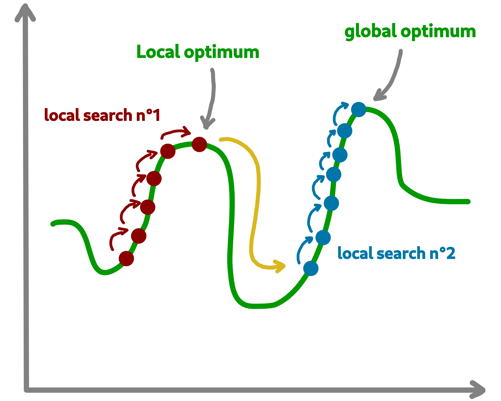

Optimisation process
=======================

Let us now tackle the interesting part concerning the search for optimum solutions in our research space.

Find local and global optima
~~~~~~~~~~~~~~~~~~~~~~~~~~~~~~~~~

Overall, in an optimization process, we will seek to find the best, or the best solutions that minimize or maximize our objective function (fitness score obtained) in order to respond to our problem.

.. image:: ../_static/documentation/search_space.png
   :width:  800 px
   :align: center

Sometimes, the search space can be very simple. A local search can provide access to the global optimum as shown in figure (a) above. 
In other cases, the search space is more complex. It may be necessary to explore more rather than exploit in order to get out of a convex zone and not find the global optimum but only a local opmatime solution. 
This problem is illustrated in figure (b).

Abstract algorithm class
~~~~~~~~~~~~~~~~~~~~~~~~~~~~~

An abstract class is proposed within Macop to generalize the management of an algorithm and therefore of a heuristic. 
It is located in the ``macop.algorithms.base`` module. 

We will pay attention to the different methods of which she is composed. This class enables to manage some common usages of operation research algorithms:

- initialization function of solution
- validator function to check if solution is valid or not (based on some criteria)
- evaluation function to give fitness score to a solution
- operators used in order to update solution during search process
- policy process applied when choosing next operator to apply
- callbacks function in order to do some relative stuff every number of evaluation or reload algorithm state
- parent algorithm associated to this new algorithm instance (hierarchy management)

She is composed of few default attributes:

- initializer: {function} -- basic function strategy to initialize solution
- evaluator: {Evaluator} -- evaluator instance in order to obtained fitness (mono or multiple objectives)
- operators: {[Operator]} -- list of operator to use when launching algorithm
- policy: {Policy} -- Policy instance strategy to select operators
- validator: {function} -- basic function to check if solution is valid or not under some constraints
- maximise: {bool} -- specify kind of optimisation problem 
- verbose: {bool} -- verbose or not information about the algorithm
- currentSolution: {Solution} -- current solution managed for current evaluation comparison
- bestSolution: {Solution} -- best solution found so far during running algorithm
- callbacks: {[Callback]} -- list of Callback class implementation to do some instructions every number of evaluations and `load` when initializing algorithm
- parent: {Algorithm} -- parent algorithm reference in case of inner Algorithm instance (optional)

.. code-block:: python

    class Algorithm():

        def __init__(self,
                    initializer,
                    evaluator,
                    operators,
                    policy,
                    validator,
                    maximise=True,
                    parent=None,
                    verbose=True):
            ...

        def addCallback(self, callback):
            """
            Add new callback to algorithm specifying usefull parameters
            """
            ...

        def resume(self):
            """
            Resume algorithm using Callback instances
            """
            ...

        def getParent(self):
            """
            Recursively find the main parent algorithm attached of the current algorithm
            """
            ...

        def setParent(self, parent):
            """
            Set parent algorithm to current algorithm
            """
            ...

        def initRun(self):
            """
            Initialize the current solution and best solution using the `initialiser` function
            """
            ...

        def increaseEvaluation(self):
            """
            Increase number of evaluation once a solution is evaluated for each dependant algorithm (parents hierarchy)
            """
            ...
                
        def getGlobalEvaluation(self):
            """
            Get the global number of evaluation (if inner algorithm)
            """
            ...

        def getGlobalMaxEvaluation(self):
            """
            Get the global max number of evaluation (if inner algorithm)
            """
            ...

        def stop(self):
            """
            Global stopping criteria (check for parents algorithm hierarchy too)
            """
            ...

        def evaluate(self, solution):
            """
            Evaluate a solution using evaluator passed when intialize algorithm
            """
            ...

        def update(self, solution):
            """
            Apply update function to solution using specific `policy`
            Check if solution is valid after modification and returns it
            """
            ...

        def isBetter(self, solution):
            """
            Check if solution is better than best found
            """
            ...

        def run(self, evaluations):
            """
            Run the specific algorithm following number of evaluations to find optima
            """
            ...

        def progress(self):
            """
            Log progress and apply callbacks if necessary
            """
            ...

The notion of hierarchy between algorithms is introduced here. We can indeed have certain dependencies between algorithms. 
The methods ``increaseEvaluation``, ``getGlobalEvaluation`` and ``getGlobalMaxEvaluation`` ensure that the expected global number of evaluations is correctly managed, just like the ``stop`` method for the search stop criterion.

The ``evaluate``, ``update`` and ``isBetter`` will be used a lot when looking for a solution in the search space. 
In particular the ``update`` function, which will call the ``policy`` instance to generate a new valid solution.
``isBetter`` method is also overloadable especially if the algorithm does not take any more into account than a single solution to be verified (verification via a population for example).

The ``initRun`` method specify the way you intialise your algorithm (``bestSolution`` and ``currentSolution`` as example) if algorithm not already initialized.

.. note:: 
    The ``initRun`` method can also be used for intialise population of solutions instead of only one best solution, if you want to manage a genetic algorithm.

Most important part is the ``run`` method. Into abstract, the ``run`` method only initialized the current number of evaluation for the algorithm based on the parent algorithm if we are into inner algorithm.
It is always **mandatory** to call the parent class ``run`` method using ``super().run(evaluations)``. Then, using ``evaluations`` parameter which is the number of evaluations budget to run, we can process or continue to find solutions into search space.

.. warning::
    The other methods such as ``addCallback``, ``resume`` and ``progress`` will be detailed in the next part focusing on the notion of callback.

Local search algorithm
~~~~~~~~~~~~~~~~~~~~~~~~~~~

We are going to carry out our first local search algorithm within our search space. A `local search` consists of starting from a solution, then applying a mutation or crossover operation to it, in order to obtain a new one. 
This new solution is evaluated and retained if it is better. We will speak here of the notion of **neighborhood exploration**. The process is then completed in the same way. 
The local search ends after a certain number of evaluations and the best evaluated solution obtained is returned.

Let's implement an algorithm well known under the name of hill climber best improvment inheriting from the mother algorithm class and name it ``HillClimberBestImprovment``.

.. code-block:: python

    """
    module imports
    """
    from macop.algorithms.base import Algorithm

    class HillClimberBestImprovment(Algorithm):

        def run(self, evaluations):
            """
            Run a local search algorithm
            """

            # by default use of mother method to initialize variables
            super().run(evaluations)

            # initialize current solution and best solution
            self.initRun()

            solutionSize = self._currentSolution._size

            # local search algorithm implementation
            while not self.stop():

                for _ in range(solutionSize):

                    # update current solution using policy
                    newSolution = self.update(self._currentSolution)

                    # if better solution than currently, replace it
                    if self.isBetter(newSolution):
                        self._bestSolution = newSolution

                    # increase number of evaluations
                    self.increaseEvaluation()

                    # stop algorithm if necessary
                    if self.stop():
                        break

                # set new current solution using best solution found in this neighbor search
                self._currentSolution = self._bestSolution
            
            return self._bestSolution

Our algorithm is now ready to work. As previously, let us define two operators as well as a random choice strategy. 
We will also need to define a **solution initialisation function** so that the algorithm can generate new solutions.

.. code-block:: python

    """
    Problem instance definition
    """
    elements_score = [ 4, 2, 10, 1, 2 ] # worth of each object
    elements_weight = [ 12, 1, 4, 1, 2 ] # weight of each object

    # evaluator instance
    evaluator = KnapsackEvaluator(data={'worths': elements_score})

    # valid instance using lambda
    validator = lambda solution: sum([ elements_weight[i] * solution._data[i] for i in range(len(solution._data))]) <= 15
    
    # initialiser instance using lambda with default param value
    initialiser = lambda x=5: BinarySolution.random(x, validator)
    
    # operators list with crossover and mutation
    operators = [SimpleCrossover(), SimpleMutation()]
    
    # policy random instance
    policy = RandomPolicy(operators)
    
    # maximizing algorithm (relative to knapsack problem)
    algo = HillClimberBestImprovment(initialiser, evaluator, operators, policy, validator, maximise=True, verbose=False)

    # run the algorithm and get solution found
    solution = algo.run(100)
    print(solution.fitness())

.. note::
    The ``verbose`` algorithm parameter will log into console the advancement process of the algorithm is set to ``True`` (the default value).

Exploratory algorithm
~~~~~~~~~~~~~~~~~~~~~~~~~~

As explained in **figure (b)** of **section 8.1**, sometimes the search space is more complicated due to convex parts and need heuristic with other strategy rather than a simple local search.

The way to counter this problem is to allow the algorithm to exit the exploitation phase offered by local search. But rather to seek to explore other parts of the research space. This is possible by simply carrying out several local searches with our budget (number of evaluations).

The idea is to make a leap in the search space in order to find a new local optimum which can be the global optimum. The explained process is illustrated below:

We are going to implement a more specific algorithm allowing to take a new parameter as input. This is a local search, the one previously developed. For that, we will have to modify the constructor a little.
Let's called this new algorithm ``IteratedLocalSearch``:

.. code-block:: python

    """
    module imports
    """
    from macop.algorithms.base import Algorithm

    class IteratedLocalSearch(Algorithm):
        
        def __init__(self,
                    initializer,
                    evaluator,
                    operators,
                    policy,
                    validator,
                    localSearch,
                    maximise=True,
                    parent=None,
                    verbose=True):
            
            super().__init__(initializer, evaluator, operators, policy, validator, maximise, parent, verbose)

            # specific local search associated with current algorithm
            self._localSearch = localSearch

            # need to attach current algorithm as parent
            self._localSearch.setParent(self)

        def run(self, evaluations, ls_evaluations=100):
            """
            Run the iterated local search algorithm using local search
            """

            # by default use of mother method to initialize variables
            super().run(evaluations)

            # initialize current solution
            self.initRun()

            # local search algorithm implementation
            while not self.stop():

                # create and search solution from local search (stop method can be called inside local search)
                newSolution = self._localSearch.run(ls_evaluations)

                # if better solution than currently, replace it
                if self.isBetter(newSolution):
                    self._bestSolution = newSolution

                self.information()

            return self._bestSolution

In the initialization phase we have attached our local search passed as a parameter with the current algorithm as parent. 
The goal is to touch keep track of the overall search evaluation number (relative to the parent algorithm).

Then, we use this local search in our ``run`` method to allow a better search for solutions.

.. code-block:: python

    """
    Problem instance definition
    """
    elements_score = [ 4, 2, 10, 1, 2 ] # worth of each object
    elements_weight = [ 12, 1, 4, 1, 2 ] # weight of each object

    # evaluator instance
    evaluator = KnapsackEvaluator(data={'worths': elements_score})

    # valid instance using lambda
    validator = lambda solution: sum([ elements_weight[i] * solution._data[i] for i in range(len(solution._data))]) <= 15
    
    # initialiser instance using lambda with default param value
    initialiser = lambda x=5: BinarySolution.random(x, validator)
    
    # operators list with crossover and mutation
    operators = [SimpleCrossover(), SimpleMutation()]
    
    # policy random instance
    policy = RandomPolicy(operators)
    
    # maximizing algorithm (relative to knapsack problem)
    localSearch = HillClimberBestImprovment(initialiser, evaluator, operators, policy, validator, maximise=True, verbose=False)
    algo = IteratedLocalSearch(initializer, evaluator, operators, policy, validator, localSearch=local_search, maximise=True, verbose=False)

    # run the algorithm using local search and get solution found 
    solution = algo.run(evaluations=100, ls_evaluations=10)
    print(solution.fitness())

.. note:: 
    These two last algorithms developed are available in the library within the module ``maocp.algorithms.mono``.

We have one final feature to explore in the next part. This is the notion of ``callback``.