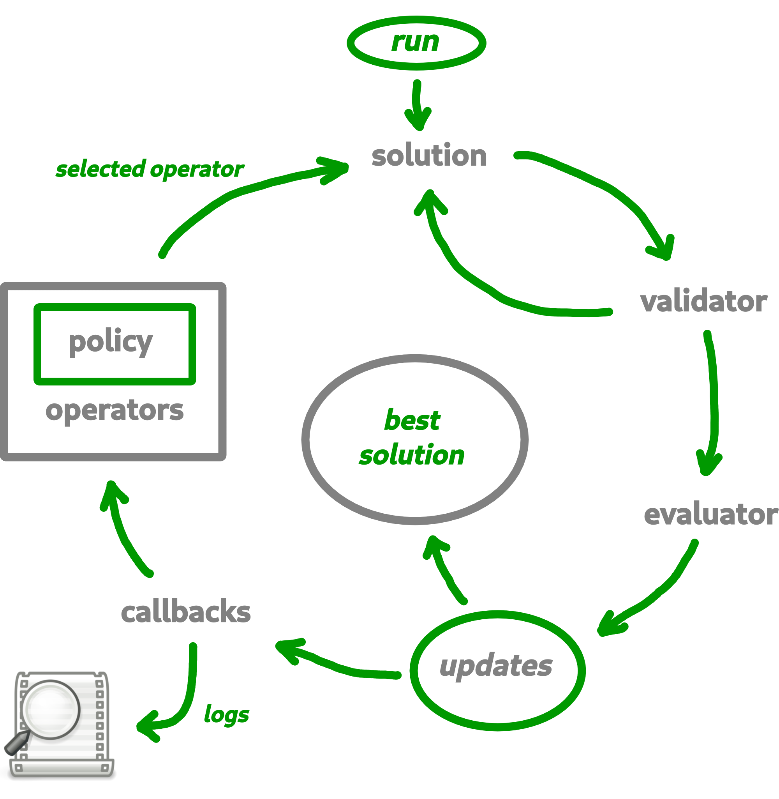

Introduction
================

`Macop` is a python package for solving discrete optimisation problems in nature. Continuous optimisation is also applicable but not yet developed. The objective is to allow a user to exploit the basic structure proposed by this package to solve a problem specific to him. The interest is that he can quickly abstract himself from the complications related to the way of evaluating, comparing, saving the progress of the search for good solutions but rather concentrate if necessary on his own algorithm. Indeed, `Macop` offers the following main and basic features: 

- **solutions:** representation of the solution ;
- **validator:** such as constraint programmig, a `validator` is function which is used for validate or not a solution data state ;
- **evaluator:** stores problem instance data and implement a `compute` method in order to evaluate a solution ;
- **operators:** mutators, crossovers update of solution ;
- **policies:** the way you choose the available operators (might be using reinforcement learning) ;
- **algorithms:** generic and implemented optimisation research algorithms ;
- **callbacks:** callbacks to automatically keep track of the search space advancement.

Based on all of these generic and/or implemented functionalities, the user will be able to quickly develop a solution to his problem while retaining the possibility of remaining in control of his development by overloading existing functionalities if necessary.