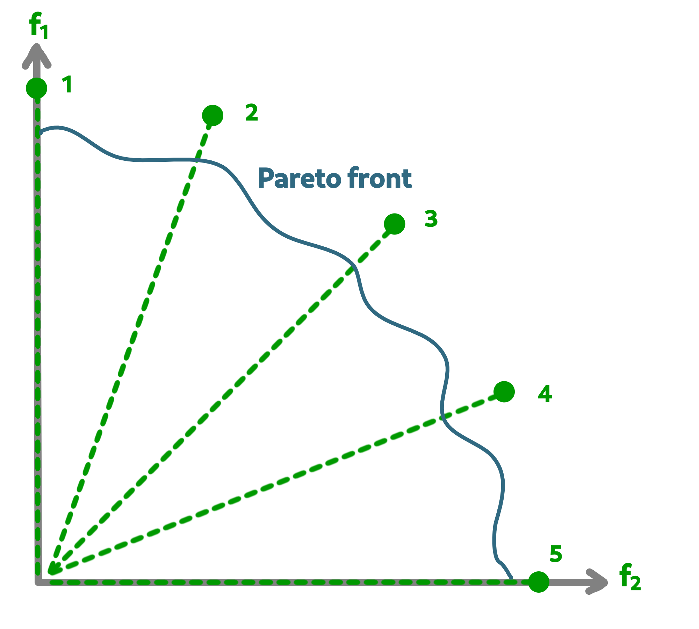

Implementation examples
=======================

Within the API of **Macop**, you can find an implementation of The Multi-objective evolutionary algorithm based on decomposition (MOEA/D) is a general-purpose algorithm for approximating the Pareto set of multi-objective optimization problems. 
It decomposes the original multi-objective problem into a number of single-objective optimization sub-problems and then uses an evolutionary process to optimize these sub-problems simultaneously and cooperatively. 
MOEA/D is a state-of-art algorithm in aggregation-based approaches for multi-objective optimization.

As illustrated below, the two main objectives are sub-divised into 5 single-objective optimization sub-problems in order to find the Pareto front.

- ``macop.algorithms.multi.MOSubProblem`` class defines each sub-problem of MOEA/D.
- ``macop.algorithms.multi.MOEAD`` class exploits ``MOSubProblem`` and implements MOEA/D using weighted-sum of objectives method.