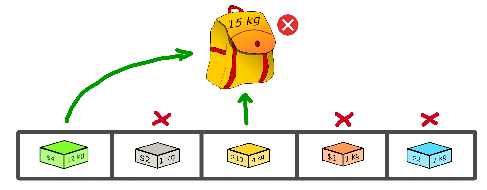

Validate a solution
======================

When an optimisation problem requires respecting certain constraints, Macop allows you to quickly verify that a solution is valid. 
It is based on a defined function taking a solution as input and returning the validity criterion (true or false).

Validator definition
~~~~~~~~~~~~~~~~~~~~~~~~~

An invalid solution can be shown below where the sum of the object weights is greater than 15:

In fact, **[1, 0, 1, 0, 0]** is an invalid solution as we have a weight of **16** which violates the knapsack capacity constraint.

To avoid taking into account invalid solutions, we can define our function which will validate or not a solution based on our problem instance:

.. code-block:: python

    """
    Problem instance definition
    """

    elements_score = [ 4, 2, 10, 1, 2 ] # worth of each object
    elements_weight = [ 12, 1, 4, 1, 2 ] # weight of each object

    """
    Validator function definition
    """
    def validator(solution):

        weight_sum = 0

        for i, w in enumerate(elements_weight):
            # add weight if current object is set to 1
            weight_sum += w * solution._data[i]
        
        # validation condition
        return weight_sum <= 15

Use of validator
~~~~~~~~~~~~~~~~~~~~~

We can now generate solutions randomly by passing our validation function as a parameter:

.. code-block:: python

    """
    Problem instance definition
    """
    ...
    
    """
    Validator function definition
    """
    ...

    # ensure valid solution
    solution = BinarySolution.random(5, validator)

.. warning::
    If the search space for valid solutions is very small compared to the overall search space, this can involve a considerable time for validating the solution and therefore obtaining a solution.

The validation of a solution is therefore now possible. In the next part we will focus on the evaluation of a solution.