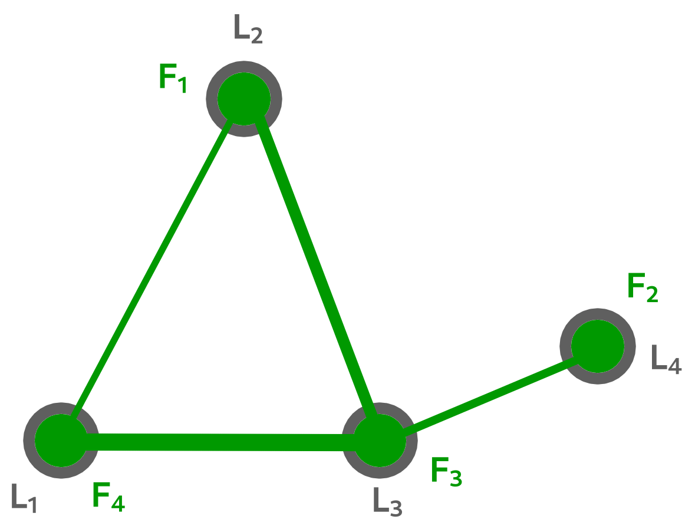

Quadratric Assignment Problem
===============================

This example will deal with the use of the **Macop** package in relation to a quadratic assignment problem (QAP). We will use a known example of this problem to associate a set of facilities (:math:`F`) to a set of locations (:math:`L`).

.. toctree::
   :maxdepth: 1
   :numbered:
   :caption: Contents:

   problem
   instance
   implementation

.. note:: 
   The full code for what will be proposed in this example is available: qapExample.py_.

.. _qapExample.py: https://github.com/jbuisine/macop/blob/master/examples/qapExample.py