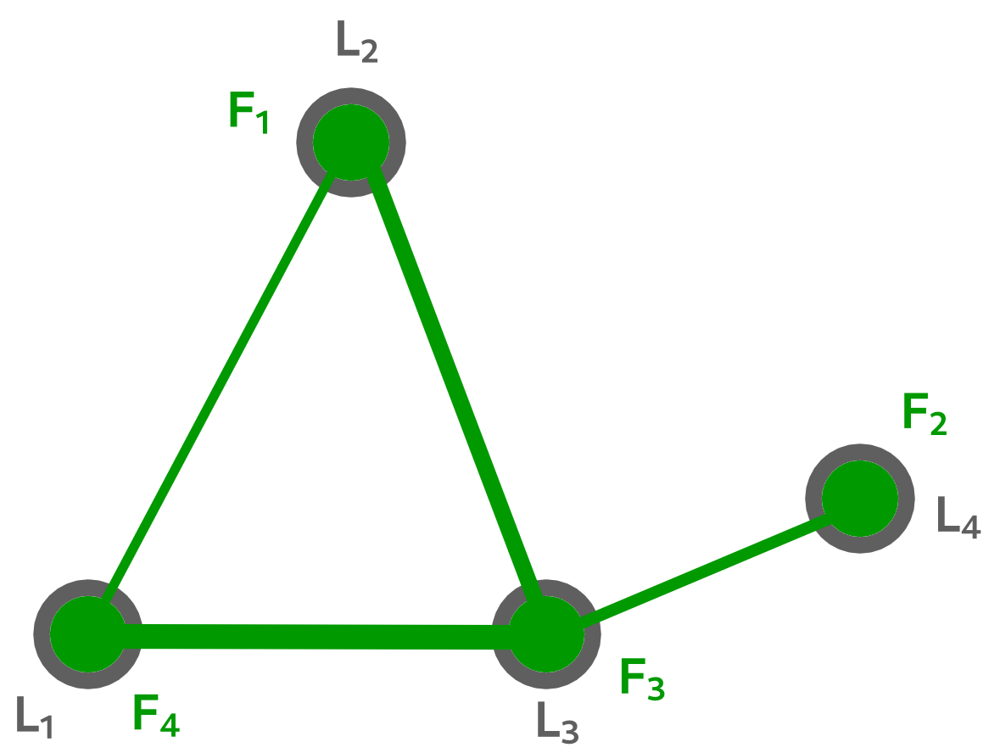

QAP problem definition
======================

The quadratic assignment problem (QAP) was introduced by Koopmans and Beckman in 1957 in the context of locating "indivisible economic activities". The objective of the problem is to assign a set of facilities to a set of locations in such a way as to minimize the total assignment cost. The assignment cost for a pair of facilities is a function of the flow between the facilities and the distance between the locations of the facilities.

Location assignment example
~~~~~~~~~~~~~~~~~~~~~~~~~~~

Consider a **facility location problem** with **four** facilities (and **four** locations). One possible assignment is shown in the figure below: facility 4 is assigned to location 1, facility 1 
is assigned to location 2, facility 3 is assigned to location 3, and facility 2 is assigned to location 3. This assignment can be written as the permutation :math:`p=\{4,1,3,2\}`, 
which means that facility 4 is assigned to location 1, facility 1 is assigned to location 2, facility 3 is assigned to location 3, and facility 2 is assigned to location 3. 
In the figure, the line between a pair of facilities indicates that there is required flow between the facilities, and the thickness of the line increases with the value of the flow. 

To calculate the assignment cost of the permutation, the required flows between facilities and the distances between locations are needed.

.. tabularcolumns:: |p{1cm}|p{1cm}|p{1cm}|p{1cm}|

.. csv-table:: flow of the current facilities
   :header: facility `i`, facility `j`, flow( `i`\, `j` )
   :widths: 2, 2, 3

   1, 4, 4
   3, 4, 10  
   3, 1, 8
   2, 1, 6  

.. csv-table:: distances of between locations
   :header: location `i`, location `j`, distances( `i`\, `j` )
   :widths: 2, 2, 3

   1, 2, 42
   1, 3, 30  
   2, 3, 41
   3, 4, 23  

Then, the assignment cost of the permutation can be computed as:

:math:`f(1,4)⋅d(1,2)+f(3,4)⋅d(1,3)+f(1,3)⋅d(2,3)+f(3,2)⋅d(3,4)` 
with result :math:`4⋅42+10⋅30+8⋅41+6⋅23=934`.

Note that this permutation is not the optimal solution.

Mathematical definition
~~~~~~~~~~~~~~~~~~~~~~~

**Sets**

- :math:`N=\{1,2,⋯,n\}`
- :math:`S_n=\phi:N→N` is the set of all permutations

**Parameters**

- :math:`F=(f_{ij})` is an :math:`n×n` matrix where :math:`f_{ij}` is the required flow between facilities :math:`i` and :math:`j`
- :math:`D=(d_{ij})` is an :math:`n×n` matrix where :math:`d_{ij}` is the distance between locations :math:`i` and :math:`j`.

**Optimization Problem**

- :math:`min_{ϕ∈S_n}\sum_{i=1}^{n}{\sum_{j=1}^{n}{f_{ij}⋅d_{\phi(i)\phi(j)}}}`

The assignment of facilities to locations is represented by a permutation :math:`\phi`, where :math:`\phi(i)` is the location to which facility :math:`i` is assigned. Each individual product :math:`f_{ij}⋅d_{\phi(i)\phi(j)}` is the cost of assigning facility :math:`i` to location :math:`\phi(i)` and facility :math:`j` to location :math:`\phi(j)`.

