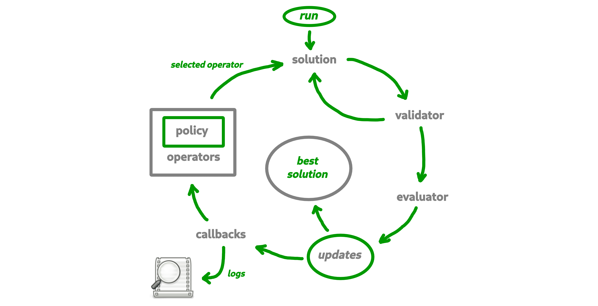

# Summary

Optimisation problems are frequently encountered in science and industry. Given a real-valued function $f$ defined on a set called the search space $X$, optimising the function $f$ consists of finding a point $x \in X$ that has the optimal value $f(x)$, or at least constructing a sequence $(x_t)_{t \in \mathbf{N}} \in X^\mathbb{N}$ that is close to the optimum. Depending on the search space $X$, optimisation problems can be globally classified as discrete problems (e.g. $X=\{0,1\}^n$) or as continuous problems (e.g. $X=\mathbb{R}^n$). Tools for modelling and solving discrete and continuous problems are proposed in the literature [@ceres-solver].

In this paper, `Macop` for `Minimalist And Customisable Optimisation Package`, is a proposed as a discrete optimisation Python package which doesn't implement every algorithm in the literature, but provides the ability to quickly develop and test your own algorithm and strategies. The main objective of this package is to provide maximum flexibility, which allows for easy experimentation in implementation.

Based on a common interaction loop (see \autoref{fig:macop-behaviour}) of all the algorithms. `Macop` wants to allow users to quickly focus on one of these features.

# Motivation

Most of the operational research libraries developed in Python offer users either problems and algorithms where it is possible to choose parameters to obtain optimal (or near optimal) results such as proposed in [@MaherMiltenbergerPedrosoRehfeldtSchwarzSerrano2016], or, libraries targeted to a specific problem or algorithm such as [@simanneal-solver]. Another package is proposed in [@solid-solver] which is a comprehensive gradient-free optimization framework written in Python. It seems very similar to `Macop`. However, hiearchic dependencies between algorithms, the notion of callbacks and adaptive operator selection are proposed within `Macop`.

On the other hand, available libraries [@pyopt-paper; @hart2017pyomo] in the literature did not allow to attach custom evaluation function to each algorithm used in this hierarchy of algorithms.
Indeed, it is sometimes possible that the main algorithm manages local searches. Each local search may evaluate the solution differently using a different evaluation function of the parent algorithm (the main algorithm). Such as example using surrogate model (with a quick evaluate function) [@10.1145/3321707.3321800] if the real evaluation function is very expensive in time. This is why in `Macop`, each algorithm can have its own mechanism (or partially), i.e. its evaluation function, its solution update operators, as well as its solution update policy. This is independent of the parent algorithm to which it is linked. This means that only the results (solutions found) are exchanged.

This package was then adapted to correspond to a formalism of implementing algorithms and problems from a simple and generic structure, hence the term minimalist in **Macop**.

Macop wants to allow users to quickly focus on one of proposed features from its interaction main loop.

# Description

At the beginning of the development of this library, the idea of making it as modular as possible was topical. By dividing the library into sub-module forms considered to be the most important to build and solve an optimisation problem.

The package consists of main several modules:

- **solutions:** representation of the solution;
- **validator:** such as constraint programming, a `validator` is function which is used for validate or not a solution data state;
- **evaluator:** stores problem instance data and implement a `compute` method in order to evaluate a solution;
- **operators:** mutators, crossovers update of solution;
- **policies:** the way you choose the available operators (might be using reinforcement learning);
- **algorithms:** generic and implemented optimisation research algorithms;
- **callbacks:** callbacks to automatically keep track of the search space advancement.

The primary advantage of using Python is that it allows you to dynamically add new members within the new implemented solution or algorithm classes. This of course does not close the possibilities of extension and storage of information within solutions and algorithms. It all depends on the need in question.

## In `macop.algorihtms` module:

Both single and multi-objective algorithms have been implemented for demonstration purposes. 

A hierarchy between dependent algorithms is also available, based on a parent/child link, allowing quick access to global information when looking for solutions, such as the best solution found, the number of global evaluations.

The mono-objective Iterated Local Search [@DBLP:books/sp/03/LourencoMS03] algorithm which aims to perform local searches (child algorithms linked to the main algorithm) and then to explore again (explorations vs. exploitation trade-off). On the multi-objective side, the MOEA/D algorithm [@DBLP:journals/tec/ZhangL07] has been implemented by using the weighted-sum of objectives to change multi-objectives problem into a set of mono-objective (Tchebycheff approach can also be used [@DBLP:journals/cor/AlvesA07]). Hence, this algorithm aims at decomposing the multi-objective problem into $mu$ single-objective problems in order to obtain the Pareto front [@kim2005adaptive] where single-objective problems are so-called child algorithms linked to the multi-objective algorithm.

The main purpose of these developed algorithms is to show the possibilities of operational search algorithm implementations based on the minimalist structure of the library.

## In `macop.solutions` module:

Currently, only combinatorial solutions (discrete problem modelisation) are offered, with the well-known problem of the knapsack as an example. Of course, it's easy to add your own representations of solutions. Solutions modeling continuous problems can also be created by the anyone who wants to model his own problem.

## In `macop.operators` and `macop.policies` modules:

A few mutation and crossover operators have been implemented, however, it remains quite simple. What is interesting here is that it is possible to develop one's own strategy for choosing operators for the next evaluation. The available UCBPolicy class proposes this functionality as an example, since it will seek to propose the best operator to apply based on a method known as the Adaptive Operator Selection (AOS) via the use of the Upper Confidence Bound (UCB) algorithm [@DBLP:journals/tec/LiFKZ14]. 

## In `macop.callbacks` module:

The use of callback instance, allows both to do an action every $k$ evaluations of information, but also to reload them once the run of the algorithm is cut. Simply inherit the abstract Callback class and implement the `apply` method to backup and `load` to restore. It is possible to add as many callbacks as required. Such as an example, implemented UCBPolicy has its own callback allowing the instance to reload previously collected statistics and restart using them.

## Documentation

Fully documented examples of the usage of **Macop** is available at [https://jbuisine.github.io/macop/](https://jbuisine.github.io/macop/).

# Conclusion

`Macop` aims to allow the modelling of discrete (usually combinatorial). It is therefore open to expansion and not closed specifically to a problem.

`Macop` proposes a simple structure of interaction of the main elements (algorithms, operators, solutions, AOS, callbacks) for the resolution of operational research problems. From its generic structure, it is possible, thanks to the flexible programming paradigm of the Python language, to easily allow the extension and development of new algorithms and problems. Based on simple concepts, this package can therefore meet the needs of the rapid problem implementation. It can also be used for quick case studies.

# Acknowledgements

This work is supported by *Agence Nationale de la Recherche* : project ANR-17-CE38-0009

# References